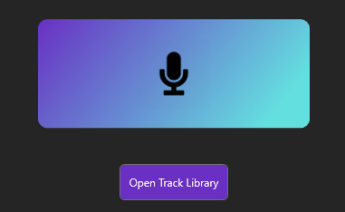

<div align="center">


[](https://t.co/Z2eSKfYpfs)
[](https://bsky.app/profile/soapwood.net)

[](https://github.com/Soapwood/VXMusic/releases/latest)


<div align="center">

### Music Recognition Overlay for Social VR
#### Also suitable for Desktop use!

# Get VXMusic
[](https://github.com/Soapwood/VXMusic/releases/latest)

Download Installer

## Quick Start Menu

<div>
    <a href="#how-to-use" class="button">How to Use</a> |
    <a href="#steamvr" class="button">Add to SteamVR</a>
</div>

<div align="left">

# Installation
An Installer is available from the Releases page. Click the download button above!

The install wizard will take care of the rest.

[VXMusic can also be easily installed as a SteamVR Plugin with one click!](#steamvr)

# Updates
You will be automatically notified when updates are available.


You can also choose if you want to be prompted when new versions are available, or manually update on the bottom right of the Desktop Client.


# How to Use
[//]: # (### 🎵 Recognise music at live events!)

[//]: # ()
[//]: # ()

### Using the Overlay, simply pull the trigger, and boop with your index finger!


### Recognition also works on Desktop! Enjoy recognising music on livestreams or videos.

## Recognition
VXMusic uses **Shazam** for music recognition.

Recognised tracks are stored in your `My Documents/VXMusic` folder.

For easy access, you can click the `Open Track Library` button on the Recognition tab.



### If you are playing VRChat, VXMusic will name the trackfile after the World you are currently in for later inspection.


### Tip: You can also add recognised tracks to <a href="#spotify" class="button">Spotify Playlists</a> and scrobble on <a href="#connections" class="button">Last.fm</a>!

## Notifications
VXMusic supports two VR notification services that allow you to receive HUD toast notifications while in VR - **SteamVR**, **XSOverlay** and **OVR Toolkit**.

To choose which service you would like to use, simply click on your desired service from the Notifications tab.


### SteamVR
SteamVR has a built-in Notifications service that VXMusic can use to send you HUD toast notifications.

This is plug and play and doesn't need any additional configuration.

### XSOverlay


VXMusic also interfaces with XSOverlay for HUD toast notifications.

XSOverlay is the recommended Notification service for how responsive and reactive it is. Ultimately it is purely aesthetical, but you will benefit from the bespoke configuration offered by XSOverlay if you are already a user. 

XSOverlay is a paid Overlay available on [Steam](https://store.steampowered.com/app/1173510/XSOverlay/), and is purely optional when using VXMusic.

### OVR ToolKit


OVR ToolKit is another fantastic option for notifications.

This also has a lovely UI for notifications, and a more bespoke desktop application for settings.

OVRToolkit is a paid Overlay available on [Steam](https://store.steampowered.com/app/1068820/OVR_Toolkit__Desktop_Overlay/), and is purely optional when using VXMusic.

## Optional Notifications - VRChat ChatBox

VXMusic can send ChatBox notifications to VRChat to share Recognition results with your friends!


You can also enable/disable this from the Notifications tab.


## Connections
Instead of just tracking recognised songs in a text file, VXMusic also supports external Music tracking services, **Spotify** and **Last.fm**!

### Spotify
#### ⚠️ Note: Spotify Integration
```
The Spotify Integration App is currently undergoing review by Spotify.

Until this is complete, it is currently required to manually add Users to the App configuration for the Playlists feature to work.

Please reach out on Discord to have your Spotify account added!
```

To connect VXMusic to your Spotify account, simply click `Connect` on the Connections tab and follow the login instructions on your browser.


Tracks will be added to automatically created Playlists. 

_If you are playing in VRChat, the current World will also be used to name the playlists for later inspection._


### Last.fm
To connect VXMusic to your Last.fm account, navigate to the Connections tab and enter your Login details.


Recognised tracks will be automatically scrobbled to your Last.fm account while using VXMusic!


## SteamVR
VXMusic can be installed as a SteamVR Plugin.

With this, you can automatically launch VXMusic when you launch SteamVR.

- Navigate to the Settings Tab
- Click "Install" under Install as SteamVR Overlay. You will be prompted when the installation is complete.
- It is recommended that you enable "Launch Overlay on Startup" for quicker startup!


## Reporting Bugs

Please direct all bug reports to the `bug_reports` channel on the VX [Discord](https://t.co/Z2eSKfYpfs)!

Each Bug report requires logs to be posted as part of the report. 

For quick access to your logs, click `Open Logs Directory` in the About tab.

Your feedback is greatly appreciated.


## License
**VXMusic** is protected under the **Mozilla Public License Version 2.0**.

_Okay... so what does this actually mean?_

You are free to fork and change VXMusic as you wish - the source code for VXMusic is open and freely distributed.

However, the MPL 2.0 license does not grant you any rights to use the Virtual Xtensions/VXMusic name, logos, or trademark branding.

If you distribute your changes, you must share your modified source code. This ensures that others can benefit from your improvements.

### Font
BRUSHSTRIKE is a brush typeface designed by Francesco Canovaro. Free for non-commercial use.

## Special Thanks

Special thanks to the testing team and early adopters. Your feedback has been immeasurable. <3

# Made in 🇮🇪
