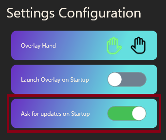

### Music Recognition Overlay for Social VR
#### Also suitable for Desktop use!

# Get VXMusic

Download Installer

## Quick Start Menu

    <a href="#how-to-use" class="button">How to Use</a> |
    <a href="#byo-api-keys" class="button">API Key Setup</a> |
    <a href="#steamvr" class="button">Add to SteamVR</a>

# Installation
An Installer is available from the Releases page. Click the download button above!

The install wizard will take care of the rest.

[VXMusic can also be easily installed as a SteamVR Plugin with one click!](#steamvr)

# Updates
You will be automatically notified when updates are available.

You can also choose if you want to be prompted when new versions are available, or manually update on the bottom right of the Desktop Client.

# How to Use
[//]: # (### 🎵 Recognise music at live events!)

[//]: # ()
[//]: # ()

### Using the Overlay, simply pull the trigger, and boop with your index finger!

### Recognition also works on Desktop! Enjoy recognising music on livestreams or videos.

## Recognition
VXMusic currently supports two Music Recognition services, **Shazam**, and **AudD.io**.

- Shazam is the recommended API to use, as it has the most rich recognition database and metadata.

- AudD.io doesn't have the same rich data experience, but it runs a lot faster than Shazam. The speed is negligible in the grand scheme of things.

### BYO API Keys
VXMusic allows you to "bring-your-own" API Key for Music Recognition Services.

This is super easy to set up, and more importantly, **FREE!**

See the instructions below on how to get your own API keys.

#### Shazam
1. Navigate to: https://rapidapi.com/apidojo/api/shazam
2. Sign in with Google, or an alternative login method.
3. Navigate back to: https://rapidapi.com/apidojo/api/shazam
4. On the top right, hit Subscribe to Test

5. Hit "Start Free Plan"

6. Hit "Subscribe"

7. From the Shazam API page, click one of the Endpoints on the left

8. Under "Code Snippets" on the right, copy the API Key under "x-rapidapi-key"

8. In VXMusic, on the Recognition tab, paste this key into the Api Key box.

9. If the light next to Shazam turns green, you have successfully set up your API Key! ✔️

#### AudD.io
// TODO

## Notifications
// TODO

## Connections
#### ⚠️ Note: Spotify Integration
The Spotify Integration App is currently undergoing review by Spotify.

Until this is complete, it is currently required to manually add Users to the App configuration for the Playlists feature to work.

Please reach out on [Discord](https://t.co/Z2eSKfYpfs) to have your Spotify account added!

## SteamVR
VXMusic can be installed as a SteamVR Plugin.

With this, you can automatically launch VXMusic when you launch SteamVR.

- Navigate to the Settings Tab
- Click "Install" under Install as SteamVR Overlay. You will be prompted when the installation is complete.
- It is recommended that you enable "Launch Overlay on Startup" for quicker startup!

## License
**VXMusic** is protected under the **Mozilla Public License Version 2.0**.

_Okay... so what does this actually mean?_

You are free to fork and change VXMusic as you wish - the source code for VXMusic is open and freely distributed.

However, the MPL 2.0 license does not grant you any rights to use the Virtual Xtensions/VXMusic name, logos, or trademark branding.

If you distribute your changes, you must share your modified source code. This ensures that others can benefit from your improvements.

### Font
BRUSHSTRIKE is a brush typeface designed by Francesco Canovaro. Free for non-commercial use.

## Special Thanks

Special thanks to the testing team and early adopters. Your feedback has been immeasurable. <3

# Made in 🇮🇪
